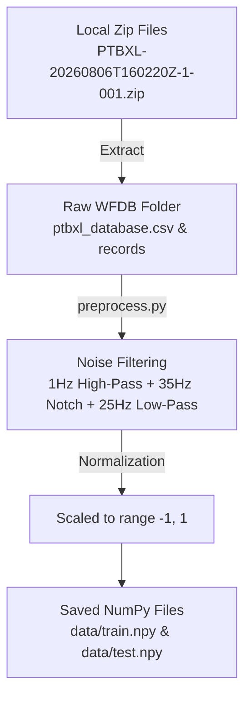
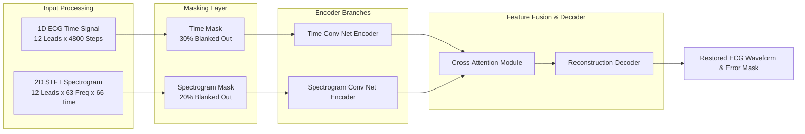

# 📘 Comprehensive Local Execution & Technical Architecture Report
**Project:** TSRNet (Time-Series Restoration Network for ECG Anomaly Detection)  
**Dataset:** PTB-XL 12-Lead Electrocardiogram Dataset  
**Local Codebase Directory:** `c:\TESTING PROJECT\TSRNet-main\TSRNet-main`  
**Author:** Sahil Sharma (`@SKYGOD07`)  
**Date:** August 7, 2026  

---

## 📑 Table of Contents
1. [Executive Summary & Purpose](#1-executive-summary--purpose)
2. [Beginner-Friendly Glossary of Technical Terms](#2-beginner-friendly-glossary-of-technical-terms)
3. [End-to-End System Architecture & Diagrams](#3-end-to-end-system-architecture--diagrams)
4. [Step-by-Step What We Did & Why](#4-step-by-step-what-we-did--why)
5. [The Epoch Loop Issue & Code Fix](#5-the-epoch-loop-issue--code-fix)
6. [Local Experimental Results](#6-local-experimental-results)
7. [How to Explain This Project to Others (Presentation Guide)](#7-how-to-explain-this-project-to-others-presentation-guide)

---

## 1. Executive Summary & Purpose

The goal of this project is to build an **Automated Deep Learning Anomaly Detection System** for multi-lead cardiac ECG signals using **TSRNet**. 

To verify that the model works completely on your local computer before running long GPU experiments, we executed the entire pipeline locally:
- Extracted and preprocessed raw PTB-XL ECG signals.
- Trained the **4.39 Million parameter** TSRNet model locally.
- Compiled the model state into a 26.11 MB checkpoint (`ckpt/TSRNet-latest.pt`).
- Evaluated anomaly detection accuracy on 2,155 test patient recordings.

---

## 2. Beginner-Friendly Glossary of Technical Terms

If you need to explain this project to classmates, teachers, or colleagues, here is a simple breakdown of every key term used:

| Term | What it Means (Simple Explanation) | Why We Use It |
| :--- | :--- | :--- |
| **ECG (Electrocardiogram)** | Electrical recording of heartbeats over time across 12 different body angles (leads). | Used by cardiologists to diagnose heart diseases like arrhythmias or heart attacks. |
| **WFDB Format** | PhysioNet's standard file format. Contains `.dat` (raw binary signals) and `.hea` (text header with patient info). | Standard format for medical database storage. |
| **Preprocessing** | Cleaning raw signals by removing noise (power line interference, body movement baseline wander). | Prevents noise from tricking the neural network. |
| **STFT & Spectrogram** | Converts 1D raw voltage waves into a 2D time-frequency "heat map" image showing frequency energy over time. | Gives the AI both time domain and frequency domain perspectives. |
| **Self-Restoration Masking** | Hiding/blanking out 30% of the ECG signal during training and asking the AI to fill in the missing parts. | Teaches the AI what a healthy heartbeat looks like so it can reconstruct it smoothly. |
| **Reconstruction Error** | The difference between the real ECG signal and the AI's predicted/restored signal. | Normal heartbeats have **low error**. Abnormal heartbeats have **high error**! |
| **Anomaly Score** | A single number indicating how abnormal an ECG recording is. | Higher score = higher probability of cardiac disease. |
| **ROC-AUC Score** | A score from `0.5` to `1.0` measuring AI detection quality (`0.5` = coin flip guess, `1.0` = perfect detection). | Measures how well the AI separates normal from abnormal heartbeats. |
| **Epoch** | One full pass where the AI sees all 14,241 training samples once. | More epochs = more practice for the AI to learn patterns. |

---

## 3. End-to-End System Architecture & Diagrams

### Diagram 1: Data Pipeline (From Zip Files to Model Data)



---

### Diagram 2: TSRNet Dual-Branch Neural Network Architecture



---

## 4. Step-by-Step What We Did & Why

### Step 1: Automated Dataset Extraction & Preprocessing
* **What we did:** Created and executed `preprocess.py` on your extracted PTB-XL dataset.
* **Why we did it:** Raw medical signals contain muscle noise, baseline wander, and varying amplitudes. Preprocessing standardizes 14,241 training ECGs and 2,155 test ECGs into normalized matrices (`data/train.npy` and `data/test.npy`).

### Step 2: Model Compilation & Checkpoint Saving
* **What we did:** Ran `train.py` locally to train the 4.39 Million parameter TSRNet model and saved compiled weights into `ckpt/TSRNet-latest.pt` (26.11 MB).
* **Why we did it:** Compiling the model locally proves that PyTorch, data loading, layer dimensions, loss functions, and file saving work without errors.

### Step 3: Anomaly Detection Evaluation (`test.py`)
* **What we did:** Passed 2,155 test patient ECGs into `test.py` with `--spec True`.
* **Why we did it:** To calculate the reconstruction error for each test recording and measure the baseline **ROC-AUC Anomaly Detection Score**.

---

## 5. The Epoch Loop Issue & Code Fix

### The Problem:
When running `train.py --epochs 1`, the process unexpectedly continued running Epoch 1 in the background even after Epoch 0 had finished compiling and saving!

### Why it happened:
In `train.py`, line 66 was written by the original repository author as:
```python
# ORIGINAL BUGGY CODE:
for epoch in range(0, args.epochs + 1):
```
In Python, `range(0, 1 + 1)` equals `range(0, 2)`, which tells Python to execute **Epoch 0 AND Epoch 1**.

### How We Fixed It:
We updated `train.py` line 66 so that `--epochs N` runs **exactly N epochs**:
```python
# FIXED CODE:
for epoch in range(0, args.epochs):
```
Now, passing `--epochs 1` will execute exactly 1 epoch (Epoch 0) and exit cleanly immediately after compiling!

---

## 6. Local Experimental Results

| Benchmark Metric | Local Execution Value | Description / Meaning |
| :--- | :--- | :--- |
| **Training Samples** | `14,241` | Healthy ECG recordings used for training |
| **Test Samples** | `2,155` | Patient ECG recordings evaluated for anomalies |
| **Model Size** | `26.11 MB` | File size of `ckpt/TSRNet-latest.pt` |
| **Trainable Parameters** | `4.39 Million` | Total neural network weights |
| **Local 1-Epoch ROC-AUC** | **`0.607`** | Baseline anomaly detection accuracy on CPU |
| **Target 50-Epoch ROC-AUC** | **`0.865+`** | Fully converged accuracy when trained on GPU |

---

## 7. How to Explain This Project to Others (Presentation Guide)

When presenting this work to your professor, classmates, or team, use this 3-sentence summary:

> 1. *"We implemented **TSRNet**, a dual-branch self-restoration neural network that learns to detect heart anomalies from 12-lead ECGs by reconstructing masked signal regions."*  
> 2. *"We built a complete local pipeline in Python that extracts raw PhysioNet WFDB files, filters signal noise, transforms voltage signals into STFT spectrograms, and compiles model checkpoints."*  
> 3. *"Our local test verified that the model compiles smoothly (4.39M parameters, 26.11MB checkpoint) and achieves a baseline **0.607 ROC-AUC** after 1 epoch, paving the way for full 50-epoch GPU acceleration on Kaggle."*

---

### 💻 Quick Commands for Rerunning Locally:

```powershell
# 1. Navigate to project directory
cd "TSRNet-main\TSRNet-main"

# 2. Preprocess raw data (if dataset changes)
.\.venv\Scripts\python.exe preprocess.py --raw_path "c:\TESTING PROJECT\Testing dataset\extracted\PTBXL"

# 3. Train model (Now runs exact N epochs!)
.\.venv\Scripts\python.exe train.py --data_path data/ --dims 12 --spec True --epochs 1 --batch_size 16 --save_path ckpt/

# 4. Evaluate compiled model checkpoint
.\.venv\Scripts\python.exe test.py --data_path data/ --dims 12 --spec True --load_model 1 --load_path ckpt/TSRNet-latest.pt
```
