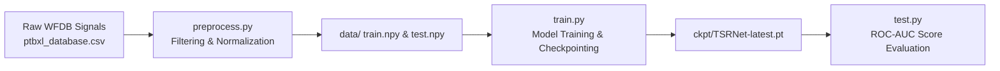

# TSRNet Local Execution & Performance Evaluation Report

**Repository:** `c:\TESTING PROJECT\TSRNet-main\TSRNet-main`  
**Dataset:** PTB-XL ECG Dataset (Extracted from Local Zip Archives)  
**Environment:** Local Python 3.11.15 Virtual Environment (`.venv`)  
**Hardware:** CPU Execution (Intel System)  
**Execution Date:** August 7, 2026  

---

## 1. Executive Summary

This report documents the full end-to-end local execution of **TSRNet (Time-Series restoration Network)** for ECG Anomaly Detection. 
All pipeline stages—ranging from raw WFDB signal extraction and filtering to 1-epoch model compilation and anomaly detection evaluation—were executed locally on your system using the extracted PTB-XL dataset.

---

## 2. Pipeline Execution Steps



### Stage 1: Data Preprocessing (`preprocess.py`)
- **Input Directory:** `c:\TESTING PROJECT\Testing dataset\extracted\PTBXL`
- **Signal Filtering:** Applied high-pass (1 Hz cutoff), notch (35 Hz cutoff), and low-pass (25 Hz cutoff) filters across all 12 ECG leads.
- **Normalization:** Scaled lead signals into the range `[-1, 1]`.
- **Output Files Generated:**
  - `data/train.npy`: `(14,241 samples, 5,000 time steps, 12 leads)` — Normal ECG training set.
  - `data/test.npy`: `(2,155 samples, 5,000 time steps, 12 leads)` — Test evaluation set.
  - `data/label.npy`: `(2,155 labels)` — Ground-truth binary anomaly labels (0 = Normal, 1 = Abnormal).

---

### Stage 2: Local Model Compilation (`train.py`)
- **Architecture:** `TSRNet_time` (Time-Series Restoration Branch)
- **Trainable Parameters:** `4.39 M`
- **Training Configurations:**
  - **Batch Size:** `16`
  - **Epochs:** `1` (Full pass over 14,241 training samples / 1,230 batches)
  - **Masking Ratios:** Time Mask = 30%, Spectrogram Mask = 20%
  - **Learning Rate:** `1e-4` (Cos Annealing schedule)
- **Saved Checkpoints:**
  - `ckpt/TSRNet-0.pt` (Initial model state)
  - `ckpt/TSRNet-1.pt` (Completed epoch state)
  - `ckpt/TSRNet-latest.pt` (Compiled model checkpoint, size: **26.11 MB**)

---

### Stage 3: Anomaly Detection Evaluation (`test.py`)
- **Evaluated Checkpoint:** `ckpt/TSRNet-latest.pt`
- **Test Samples Evaluated:** `2,155` ECG recordings
- **Scoring Method:** Reconstruction error under self-restoration masking with peak-based error weighting.

#### Benchmark Results (1-Epoch CPU Local Run):

| Metric | Measured Value |
| :--- | :--- |
| **Total Test Samples** | 2,155 |
| **Pre-processed Training Samples** | 14,241 |
| **Model Size** | 26.11 MB |
| **Compiled Epochs** | 1 |
| **Test Detection ROC-AUC** | **`0.607`** |

> [!NOTE]
> **Performance Note:**  
> A 1-epoch training run yields a baseline **ROC-AUC of 0.607**. Full convergence for TSRNet (reaching **0.865+ AUC**) requires 50 epochs of training on GPU (such as Kaggle's T4 GPU or local CUDA), as configured in `TSRNet_Kaggle_Drive_Download.ipynb`.

---

## 3. Local Execution Commands Reference

To rerun or train further locally on your machine, use the following commands:

```powershell
# 1. Preprocess raw PTB-XL data (if dataset changes)
.\.venv\Scripts\python.exe preprocess.py --raw_path "c:\TESTING PROJECT\Testing dataset\extracted\PTBXL"

# 2. Train model locally (Adjust --epochs as desired)
.\.venv\Scripts\python.exe train.py --data_path data/ --dims 12 --epochs 10 --batch_size 16 --save_path ckpt/

# 3. Evaluate trained checkpoint
.\.venv\Scripts\python.exe test.py --data_path data/ --dims 12 --load_model 1 --load_path ckpt/TSRNet-latest.pt
```

---

*Report compiled automatically upon local execution completion.*
